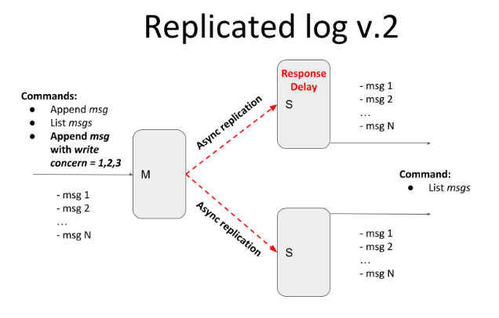

# Replicated Log

Distributed system for basic logs replication. Primary-secondary push model.

### Current scope

The Replicated Log should have the following deployment architecture: one **Primary** and any number of **Secondaries**.



**Master** should expose a simple HTTP server (or alternative service with a similar API) with:
- _POST method_ - appends a message into the in-memory list
- _GET method_ - returns all messages from the in-memory list

**Secondary** should expose a simple  HTTP server(or alternative service with a similar API)  with:
- _GET method_ - returns all replicated messages from the in-memory list

Properties and assumptions:
- after each POST request, the message should be replicated on every Secondary server
- Master should ensure that Secondaries have received a message via ACK
- at this stage assume that the communication channel is a perfect link (no failures and messages lost)
- any RPC framework can be used for Master-Secondary communication (Sockets, language-specific RPC, HTTP, Rest, gRPC, …)
- your implementation should support logging
- Master and Secondaries should run in Docker

Current iteration should provide tunable semi-synchronicity for replication, by defining write concern parameters.
- client POST request in addition to the message should also contain write concern parameter w=1,2,3,..,n
- w value specifies how many ACKs the master should receive from secondaries before responding to the client
  - w = 1 - only from master
  - w = 2 - from master and one secondary
  - w = 3 - from master and two secondaries

Please emulate replicas inconsistency (and eventual consistency) with the master by introducing the artificial delay on the secondary node. In this case, the master and secondary should temporarily return different messages lists.
Add logic for messages deduplication and to guarantee the total ordering of messages.


### How to run

```shell
  cd deployment
  docker-compose up --build
  docker-compose down
```