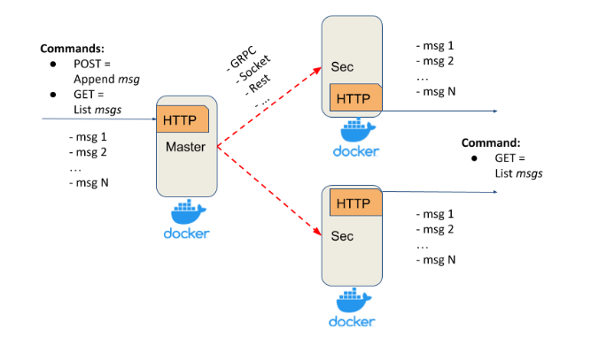

# replicated-log

Distributed system for basic logs replication. Primary-secondary push model.

### Current scope of features

The Replicated Log should have the following deployment architecture: one **Primary** and any number of **Secondaries**.



**Master** should expose a simple HTTP server (or alternative service with a similar API) with:
- _POST method_ - appends a message into the in-memory list
- _GET method_ - returns all messages from the in-memory list

**Secondary** should expose a simple  HTTP server(or alternative service with a similar API)  with:
- _GET method_ - returns all replicated messages from the in-memory list

Properties and assumptions:
- after each POST request, the message should be replicated on every Secondary server
- Master should ensure that Secondaries have received a message via ACK
- Master’s POST request should be finished only after receiving ACKs from all Secondaries (blocking replication approach)
- to test that the replication is blocking, introduce the delay/sleep on the Secondary
- at this stage assume that the communication channel is a perfect link (no failures and messages lost)
- any RPC framework can be used for Master-Secondary communication (Sockets, language-specific RPC, HTTP, Rest, gRPC, …)
- your implementation should support logging
- Master and Secondaries should run in Docker


### How to run

```shell
  cd deployment
  docker-compose up --build
  docker-compose down
```