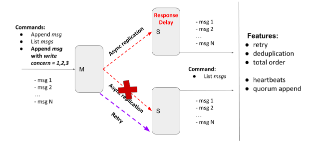

# Replicated Log

Distributed system for basic logs replication. Primary-secondary push model.

### Description

The Replicated Log should have the following deployment architecture: one **Primary** and any number of **Secondaries**.



**Primary** exposes a simple HTTP server (or alternative service with a similar API) with:

- _POST method_ - appends a message into the in-memory list
- _GET method_ - returns all messages from the in-memory list

**Secondary** exposes a simple HTTP server(or alternative service with a similar API)  with:

- _GET method_ - returns all replicated messages from the in-memory list

Current implementation provides **tunable semi-synchronicity** for replication with a **retry mechanism** that
delivers all messages **exactly-once in total order**.

#### Properties and assumptions:

- after each POST request, the message should be replicated on every **Secondary** server
- **Primary** should ensure that Secondaries have received a message via ACK
- any RPC framework can be used for Primary-Secondary communication (Sockets, language-specific RPC, HTTP, Rest,
  gRPC, …) -- my implementation uses **RESTful API**.
- your implementation supports **logging**
- **Primary** and **Secondaries** should run in **Docker**
- implementation should provide tunable **semi-synchronicity** for replication, by defining **write concern**
  parameters:
    - client POST request in addition to the message should also contain write concern parameter `w=1,2,3,..,n`
    - `w` value specifies how many ACKs the master should receive from secondaries before responding to the client
        - `w = 1` - only from **Primary**
        - `w = 2` - from **Primary** and one **Secondary**
        - `w = 3` - from **Primary** and two **Secondaries**
- if message delivery fails (due to connection, or internal server error, or **Secondary** is unavailable) the delivery
  attempts should be repeated - **retry**
    - if one of the **Secondaries** is down and `w=3`, the client should be blocked until the node becomes available.
      Clients running in parallel shouldn’t be blocked by the blocked one.
    - if `w>1` the client should be blocked until the message will be delivered to all **Secondaries** required by the
      write concern level. Clients running in parallel shouldn’t be blocked by the blocked one.
    - all messages that **Secondaries** have missed due to unavailability should be replicated after (re)joining the
      master
    - retries can be implemented with an unlimited number of attempts but, possibly, with some “smart” delays logic -- *
      *Exponential Backoff And Jitter**
    - there is a timeout for the **Primary** in case if there is no response from the **Secondary**
- all messages should be present **exactly once** in the **Secondary** log - **deduplication**
- the order of messages should be the same in all nodes - **total order**
    - if **Secondary** has received messages `[msg1, msg2, msg4]`, it shouldn’t display the message `msg4` until
      the `msg3` will be received
- **Heartbeats**. To make retry logic smarter, there is a simple healthcheck mechanism was implemented between **Primary**
  and **Secondaries**
    - every `N` milliseconds **Primary** refreshes health statuses from all secondaries
    - this health
      status [is considered in retry logic](https://github.com/BaLiKfromUA/replicated-log/blob/iteration-3/internal/replication/executor.go#L129)
      to decrease number of unsuccessful network calls
- **Quorum append**. If there is no quorum the **Primary** will be switched into **read-only mode** and would
  reject `append-message` requests.

#### Highlights of implementation

- Public, internal and testing APIs both for **Primary** and **Secondary** can be found [here](./api).
- `Dockerfile` is the same both for **Primary** and **Secondary** can be found [here](./build/Dockerfile).
- For system testing I use `docker-compose` and `pytest`. Whole setup can be
  found [here](./deployment/docker-compose.yaml)

##### Testing

> after each POST request, the message should be replicated on every **Secondary** server

Tested via end-to-end test. [Link](https://github.com/BaLiKfromUA/replicated-log/blob/iteration-3/tests/test_replication_example.py#L7)

> implementation should provide tunable **semi-synchronicity** for replication, by defining **write concern**
parameters

Tested by several end-to-end tests in [test_replication_with_broken_secondaries.py](./tests/test_replication_with_broken_secondaries.py) file

> if message delivery fails (due to connection, or internal server error, or **Secondary** is unavailable) the delivery
attempts should be repeated - **retry**

Retry logic implementation -- [link](https://github.com/BaLiKfromUA/replicated-log/blob/iteration-3/internal/replication/executor.go#L121).

Tested via integration and unit tests -- [executor_test.go](./internal/replication/executor_test.go)

> all messages should be present **exactly once** in the **Secondary** log - **deduplication**

Implemented on a storage level. Tested via unit test -- [link](https://github.com/BaLiKfromUA/replicated-log/blob/iteration-3/internal/storage/inmemory_test.go#L26)

> the order of messages should be the same in all nodes - **total order**

Implemented on a storage level. Tested via unit test -- [link](https://github.com/BaLiKfromUA/replicated-log/blob/iteration-3/internal/storage/inmemory_test.go#L49)

> To make retry logic smarter, there is a simple healthcheck mechanism was implemented between **Primary**
and **Secondaries**

Implementation -- [daemon.go](./internal/healthcheck/daemon.go)

Tested via unit tests -- [daemon_test.go](./internal/healthcheck/daemon_test.go)

Used during retry logic [here](https://github.com/BaLiKfromUA/replicated-log/blob/iteration-3/internal/replication/executor.go#L129)

> If there is no quorum the **Primary** will be switched into **read-only mode** and would
reject `append-message` requests

"No quorum" case is checked [here](https://github.com/BaLiKfromUA/replicated-log/blob/iteration-3/internal/primary/http.go#L37).

Tested via system test [here](https://github.com/BaLiKfromUA/replicated-log/blob/iteration-3/tests/test_replication_with_broken_secondaries.py#L123)

### How to run tests

- Unit and Integration tests:

```shell
  go test -v ./...
```

- System tests (located [here](./tests)):

```shell
  cd tests
  docker-compose build
  docker-compose run tester
```


### How to deploy to k8s

```shell
minikube image build -t replicated-log:dev -f build/Dockerfile .
cd deployment/k8s/
kubectl apply -f . 
```